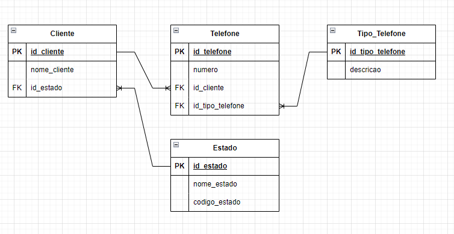

## Respostas das Questões

1. Observe o trecho de código:
```
int INDICE = 12, SOMA = 0, K = 1;

enquanto K < INDICE faça

{ K = K + 1; SOMA = SOMA + K;}

imprimir(SOMA);
```

Ao final do processamento, qual será o valor da variável SOMA?

Resposta: 77

2. Descubra a lógica e complete o próximo elemento:
    1. 1, 3, 5, 7, **9**
    2. 2, 4, 8, 16, 32, 64, **128**
    3. 0, 1, 4, 9, 16, 25, 36, **49**
    4. 4, 16, 36, 64, **100**
    5. 1, 1, 2, 3, 5, 8, **13**
    6. 2,10, 12, 16, 17, 18, 19, **20** 

3. Dado um vetor que guarda o valor de faturamento diário de uma distribuidora de todos os dias de um ano, faça um programa, na linguagem que desejar, que calcule e retorne:

- O menor valor de faturamento ocorrido em um dia do ano;
- O maior valor de faturamento ocorrido em um dia do ano;
- Número de dias no ano em que o valor de faturamento diário foi superior à média anual.

 - **Considerar o vetor já carregado com as informações de valor de faturamento.**

- **Podem existir dias sem faturamento, como nos finais de semana e feriados. Estes dias devem ser ignorados no cálculo da média.**

- **Utilize o algoritmo mais veloz que puder definir.**

  Resposta: O código foi escrito em Java
  
**App.java**  

Método principal da classe. Verifico os valores máximos e mínimos pelos métodos max e min da classe Collections do Java.
```
    public static void main(String[] args) throws Exception {
        List<Double> faturamentoDiario = Arrays.asList(carregarVetor());
        Double faturamentoMaximo = Collections.max(faturamentoDiario);
        Double faturamentoMinimo = Collections.min(faturamentoDiario);
        Integer diasSuperiorAMedia = diasAcimaFaturamentoMedio(faturamentoDiario);


        System.out.printf("O maior faturamento do ano foi: R$ %.2f\nO menor faturamento do ano foi: R$ %.2f\nO número de dias que o faturamento superou a média anual foi: %d",
        faturamentoMaximo,faturamentoMinimo,diasSuperiorAMedia); 
    }

```
Obtenho a média do faturamento anual, desconsiderando os valores de faturamento iguais a zero.
```
    public static Double mediaFaturamento(List<Double> faturamento){
        Double soma = 0.0;
        Integer cont = 0;
        for (Double valor : faturamento) {
            if(!valor.equals(0.0)){
                soma += valor;
                cont++;
            }
        }
        return cont > 0 ? soma / cont : 0.0;
    }
```
Com o método média, posso obter os valores dos dias que superaram o valor médio anual
```
    public static Integer diasAcimaFaturamentoMedio(List<Double> faturamento){
        Integer cont = 0;
        Double media = mediaFaturamento(faturamento);
        for (Double valor : faturamento) {
            if(valor > media){
                cont++;
            }
        }
        return cont;
    }
```
O método abaixo carrega o vetor de uma base de dados, no caso em questão ele gera uma aleatóriamente
```
    private static Double[] carregarVetor(){
        Random rand = new Random();
        Double[] faturamentoDiario = new Double[365];
        for (int i = 0; i < faturamentoDiario.length; i++) {
            faturamentoDiario[i] = rand.nextBoolean() ? rand.nextDouble(0, 100000) : 0.0;
        }
        return faturamentoDiario;
    }
```
O código está na pasta src/App.java

4 - Banco de dados

Uma empresa solicitou a você um aplicativo para manutenção de um cadastro de clientes. Após a reunião de definição dos requisitos, as conclusões foram as seguintes:

- Um cliente pode ter um número ilimitado de telefones;
- Cada telefone de cliente tem um tipo, por exemplo: comercial, residencial, celular, etc. O sistema deve permitir cadastrar novos tipos de telefone;
- A princípio, é necessário saber apenas em qual estado brasileiro cada cliente se encontra. O sistema deve permitir cadastrar novos estados;

Você ficou responsável pela parte da estrutura de banco de dados que será usada pelo aplicativo. Assim sendo:

- Proponha um modelo lógico para o banco de dados que vai atender a aplicação. Desenhe as tabelas necessárias, os campos de cada uma e marque com setas os relacionamentos existentes entre as tabelas;
- Aponte os campos que são chave primária (PK) e chave estrangeira (FK);
- Faça uma busca utilizando comando SQL que traga o código, a razão social e o(s) telefone(s) de todos os clientes do estado de São Paulo (código “SP”);

Resposta:

O mapeamento lógico que atende aos requisitos:
1. Cliente 
- id_cliente (PK): Identificador único do cliente.
- nome_cliente: Nome ou razão social do cliente.
- id_estado (FK): Referência ao estado onde o cliente se encontra.
2. Telefone
- id_telefone (PK): Identificador único do telefone.
- numero: Número do telefone.
- id_cliente (FK): Referência ao cliente.
- id_tipo_telefone (FK): Referência ao tipo de telefone.
3. Tipo_Telefone
- id_tipo_telefone (PK): Identificador único do tipo de telefone.
- descricao: Descrição do tipo de telefone (celular, residencial, etc.).
4. Estado
- id_estado (PK): Identificador único do estado.
- nome_estado: Nome completo do estado (ex.: São Paulo).
- codigo_estado: Código do estado (ex.: SP).

Essas tabelas atendem as padronizações e normatizações de banco de dados. Os relacionamentos entre as tabelas são:
1. (1:N) Cliente:Telefone
2. (1:N) Tipo_Telefone:Telefone
3. (1:N) Estado:Cliente

Onde (1:N) representa uma relação um para muitos, como pode ser observado na imagem abaixo:



Já o código abaixo traz os valores que é pedido:
```
SELECT 
    c.id_cliente, 
    c.nome_cliente, 
    t.numero AS telefone
FROM 
    Cliente c
JOIN 
    Telefone t ON c.id_cliente = t.id_cliente
JOIN 
    Estado e ON c.id_estado = e.id_estado
WHERE 
    e.codigo_estado = 'SP';
```
O comando JOIN é usado para unir as tabelas Cliente, Telefone e Estado, onde a condição de união entre Cliente e Telefone é c.id_cliente = t.id_cliente, e a condição de união entre Cliente e Estado é c.id_estado = e.id_estado já a cláusula WHERE filtra os resultados para trazer apenas os clientes cujo estado seja São Paulo (e.codigo_estado = 'SP'). 

5. Dois veículos, um carro e um caminhão, saem respectivamente de cidades opostas pela mesma rodovia. O carro, de Ribeirão Preto em direção a Barretos, a uma velocidade constante de 90 km/h, e o caminhão, de Barretos em direção a Ribeirão Preto, a uma velocidade constante de 80 km/h. Quando eles se cruzarem no percurso, qual estará mais próximo da cidade de Ribeirão Preto?

- Considerar a distância de 125km entre a cidade de Ribeirão Preto <-> Barretos.
- Considerar 3 pedágios como obstáculo e que o carro leva 5 minutos a mais para passar em cada um deles, pois ele não possui dispositivo de cobrança de pedágio.
- Explique como chegou no resultado.

Resposta: 
Dada a situação após o cruzamento dos veículos, pois no momento que houver o cruzamento ambos os veículos estaram a mesma distância de Ribeirão Preto, dessa forma devemos encontrar o momento e a posição onde ocorrerá esse cruzamento.

A->--------------------------------<-B

Dado A sendo o carro estando na posição zero (Ribeirão Preto).
Dado B sendo caminhão estando na posição 125km (Barretos)

Temos que a função horária do carro é dada por:

$\ S_c = 90*(t - ((n)*5/60))\$

Onde:
- t é o tempo em horas;
- n é o número de pedágios no caminho;

O tempo no pedágio deve ser descontado do tempo que o carro está andando na viagem.

A função horária do caminhão é:

$\ S_t = 125 - 80*t\$

O caminhão não para nos pedágios, e como ele segue na direção contrária ao sentido do carro que consideramos positiva, usamos a velocidade como sendo negativa.

Como a posição dos pedágios não foi fornecida no enunciado, podemos estudar os 4 casos onde o carro pode se encontrar

1. O Carro passa por apenas um pedágio antes de cruzar o caminhão;
2. O Carro passa por dois pedágios antes de cruzar o caminhão;
3. O Carro passa por três pedágios antes de cruzar o caminhão;

Para resolver essa equação devemos encontrar o tempo em que esse cruzamento ocorre e em que ponto da estrada ele ocorre, podemos encontrar esses valores a partir da equação abaixo:

$\ t = (125 + 7.5*n)/170\$

Essa função é encontrada ao igualar as funções horárias dos veiculos, encontrando esse tempo é só encontrar a posição utilizando qualquer uma das duas equações. Analizando os resultados dos casos, temos:

1. t = 0.78 h, S = 62.6 Km.
2. t = 0.82 h, S = 59.4 Km.
3. t = 0,87 h, S = 55.4 Km.

Em ambos os casos, o caminhão se encontra mais próximo de Ribeirão Preto se comparado ao carro, após o cruzamento de ambos na estrada.
